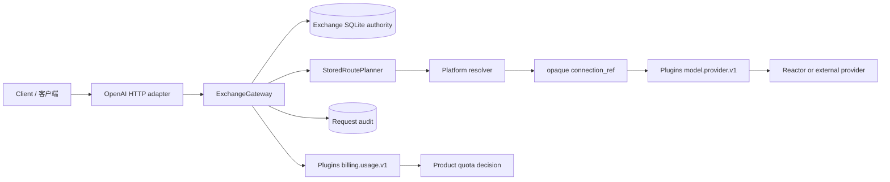

# Cyrene Exchange Architecture / 架构

Exchange owns Product gateway policy and state. Platform owns generic
capability discovery and selection. Plugins own versioned capability contracts,
endpoint runtime, provider translation, and usage aggregation. Reactor owns
model serving; Exchange references it through Product resources and opaque
provider bindings.

Exchange 拥有 Product 网关策略与状态；Platform 拥有通用能力发现和选择；Plugins
拥有版本化能力契约、Endpoint 运行时、Provider 转换与用量汇总；Reactor 拥有模型
服务。Exchange 只通过 Product 资源与不透明 Provider binding 引用这些能力。

The request body never supplies actor or workspace identity. A bearer token is
resolved to `RequestPrincipal`; the boolean-token compatibility path and its
synthetic identity have been removed. Endpoint, route, credential, audit, and
quota policy are persisted by `ExchangeStore`, so there is one writable Product
authority.

请求体不能提供 actor 或 workspace 身份。Bearer token 必须解析为
`RequestPrincipal`；旧布尔 token 校验与虚构身份已删除。Endpoint、Route、凭据、
审计和配额策略统一由 `ExchangeStore` 持久化，Product 只有一个可写权威。

The retired Spring Coordinator and `ai_service.proto` data plane directly
managed workers, health checks, scheduling, GPU telemetry, and inference RPCs.
Those responsibilities belong to Platform, Plugins, and Reactor, so the active
repository no longer builds or publishes that protocol.

已退役的 Spring Coordinator 与 `ai_service.proto` 曾直接管理 Worker、健康检查、
调度、GPU 遥测和推理 RPC；这些职责属于 Platform、Plugins 与 Reactor，因此当前
仓库不再构建或发布该协议。
