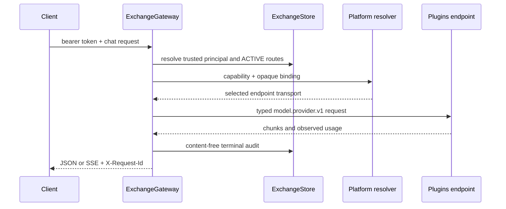

# Architecture overview / 架构总览

The active repository has two Python layers: `src/cyrene_exchange` contains
request normalization, gateway policy, capability ports, direct Plugin
transport, and the replaceable HTTP adapter; `product/src/cyrene_exchange_product`
contains the SQLite authority, control API, route admission, audit, and quota
policy.

当前仓库有两层 Python 源码：`src/cyrene_exchange` 包含请求规范化、网关策略、能力
端口、Plugin 直连传输与可替换 HTTP adapter；
`product/src/cyrene_exchange_product` 包含 SQLite 权威、控制 API、Route admission、
审计与配额策略。

There is no active Coordinator worker pool or Exchange-owned inference RPC.
Queueing, execution placement, worker health, GPU telemetry, and serving belong
outside this Product repository.

当前不存在 Coordinator Worker pool 或 Exchange-owned inference RPC。排队、执行
放置、Worker 健康、GPU 遥测和模型服务属于本 Product 仓库之外。

## Authority table / 权威表

| Concern | Canonical owner |
| --- | --- |
| Endpoint, route, credential, audit, quota limit | Exchange Product `ExchangeStore` |
| Request normalization, fallback, response policy | `ExchangeGateway` |
| Capability resolution and execution mode selection | Platform |
| `model.provider.v1` contract and endpoint | Plugins |
| Provider translation and serving | Official provider Plugin, Reactor, or external provider |
| Usage aggregation and cost calculation | Plugins `billing.usage.v1` |
| Worker/process lifecycle and hardware facts | Platform/Reactor execution plane |
